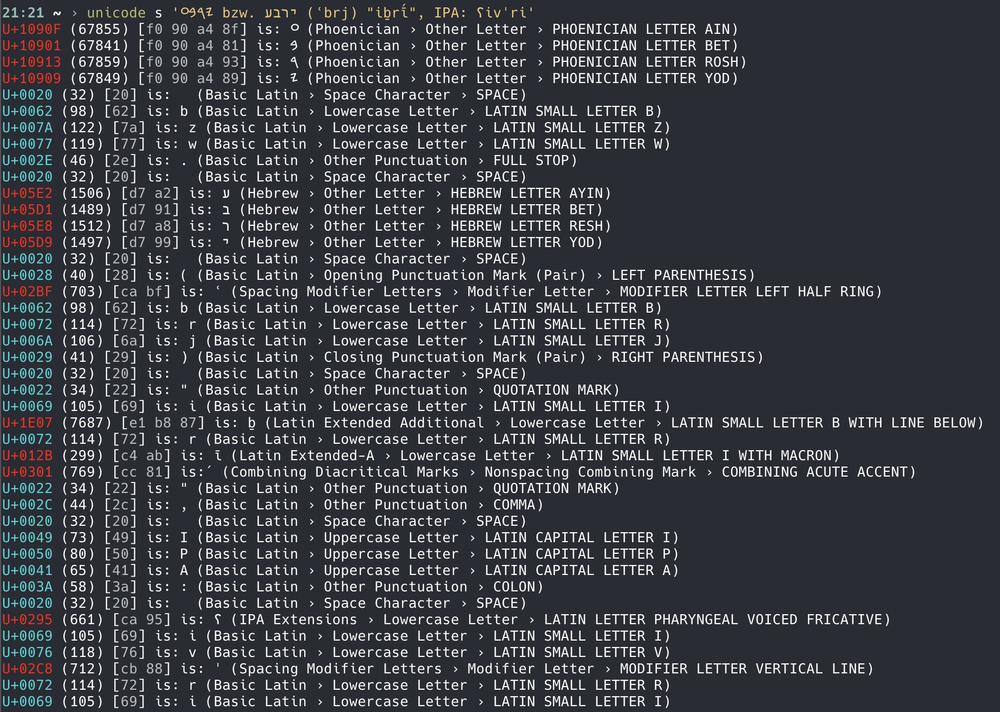

# unicodes
Unicode information

usage: `unicode TYPE INPUT`

types: `s` (string), `d` (decimal), `h` (hex), `b` (utf8 byte seq) or `r` (hex-range)

examples:



```
$ unicode r 3b1-3c9
α β γ δ ε ζ η θ ι κ λ μ ν ξ ο π ρ ς σ τ υ φ χ ψ ω

$ unicode r 10840-10855
𐡀 𐡁 𐡂 𐡃 𐡄 𐡅 𐡆 𐡇 𐡈 𐡉 𐡊 𐡋 𐡌 𐡍 𐡎 𐡏 𐡐 𐡑 𐡒 𐡓 𐡔 𐡕 
```
