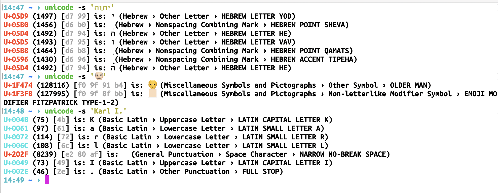

# unicodes
Unicode / utf8 investigation

[the code is pretty simple](https://github.com/haalven/unicodes/blob/main/unicode.py)

usage: `./unicode.py <TYPE> <INPUT>`

TYPE: `-u` (unicode hex key), `-d` (decimal key), `-b` (byte seq utf8), `-s` (string), or `-r` (range of hexkeys)

## investigate strange characters



- incl. utf-8 byte sequence
- incl. Unicode block name
- incl. Codepoint category
- incl. FULL CHARACTER NAME

## print unicode ranges

```
$ unicode -r 3b1-3c9
α β γ δ ε ζ η θ ι κ λ μ ν ξ ο π ρ ς σ τ υ φ χ ψ ω

$ unicode -r 10840-10855
𐡀 𐡁 𐡂 𐡃 𐡄 𐡅 𐡆 𐡇 𐡈 𐡉 𐡊 𐡋 𐡌 𐡍 𐡎 𐡏 𐡐 𐡑 𐡒 𐡓 𐡔 𐡕 
```
